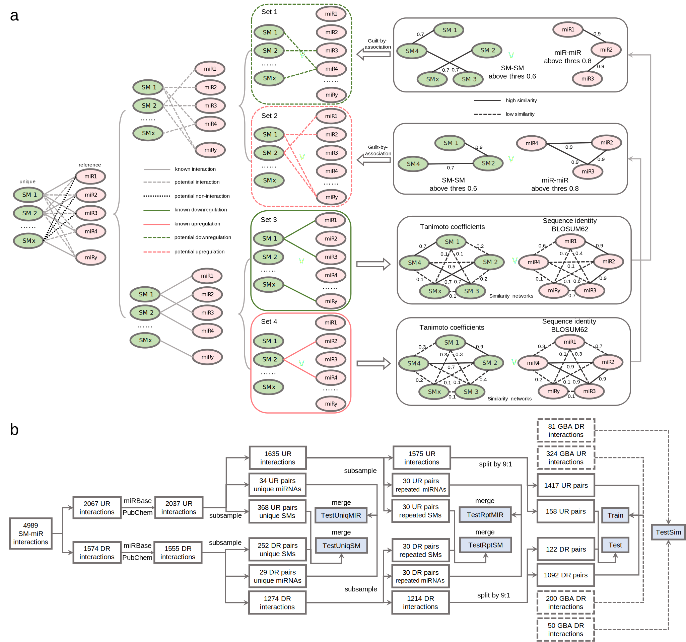
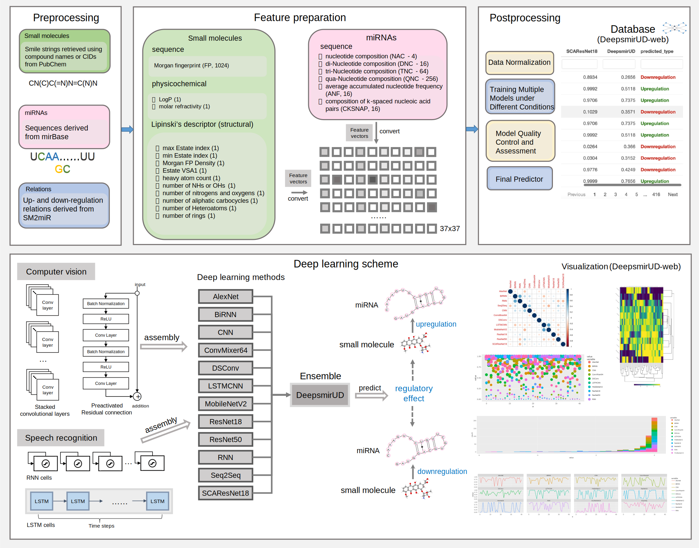

DeepsmirUD-web
================

DeepsmirUD-web catalogues predictions of SM-mediated regulatory effects
upon miRNAs from all relations used in the DeepsmirUD paper. By trawling
through miRNA-disease data from miRCancer, we also established a
database of drug–cancer associations to provide potential therapeutics
based on the SM-miR upregulation and downregulation profiles predicted
by DeepsmirUD.

# Introduction

MicroRNAs (miRNAs) are a class of non-coding RNAs, which are vital to
biological activities by primarily virtue of their
post-transcriptionally regulatory mechanisms. miRNAs are often known to
downregulate the expression of genes by inhibiting translation or
promoting the degradation of target mRNAs, thereby exerting an impact on
the gene regulatory pathways to either remodel homeostasis or give rise
to malignancy such as leukemia and osteoarthritis. It has been reported
that up to thousands of mRNAs can be targeted by a single miRNA and vice
versa. Therefore, there are a myriad of gateways for miRNAs to influence
the regulated gene pathways. Growing evidence has particularly suggested
that miRNAs play important roles in cancer and their expression
abnormalities can lead to a variety of diseases or supress tumor
progression. In this regard, therapeutics can be achieved by targeting
oncogenic miRNAs with potential drug molecules to alter their
expression. Existing experiments have revealed that many small molecules
(SMs) have held great promise as pharmaceuticals to target the miRNAs to
modulate their expression thereafter.

According to the SM2miR database built based on more than 2000
publications, only 1.14% of all possible SM-miR pairs interwoven with
1492 unique miRNAs and 212 unique small molecules (after pre-processing)
are catalogued to be experimentally verified (Figure 1). It is therefore
in addition to the experimental profiling that much attention has been
paid for designing computational techniques to speed up the inference of
binding. A precise understanding of the types of SM-mediated regulation
on miRNAs may provide direct or indirect evidence for cancer
pathogenesis and therapeutics in the sense that the oncogenic signalling
pathways regulated by the miRNAs are affected. Therefore, the efficient
identification and the follow-up analysis of disease-associated miRNAs
targeted by small molecule drugs with a measurable influence on the
miRNA expression are becoming increasingly important and have emerged as
a new therapeutic treatment in miRNA pharmacogenomics.

*Figure 1. Data wrangling of upregulated and downregulated relations. a.
Inference of potentially upregulated and downregulated relations using
guilt-by-association. b. Flowchart of generating the Train, Test,
TestSim, TestRptMIR, TestRptSM, TestUniqMIR, and TestUniqSM datasets.*

“Advances in deep learning have spawned ample opportunity to promote
biological applications and discoveries such as protein structural and
functional prediction. In order for maximization of method performance
specific to the regulatory effect prediction, we attempted to seek prime
solutions from the computer-vision and speech-recognition fields by
utilizing both well-established models including AlexNet, MobileNetV2,
Transformer-based ConvMixer, ResNet18, ResNet50, attention-based
SCAResNet18, and our self-assembly architectures, including
convolutional neural networks (CNNs), recurrent neural networks (RNNs),
bidirectional recurrent neural networks (BiRNNs), depth-wise and
separable neural networks, the fusion of long short-term memory (LSTM)
neural networks and CNNs, and sequence-to-sequence (Seq2Seq) neural
networks. These models, the vast majority of which can be trained fast
due to the residual connection in design or required parameter numbers,
allow relatively full-scale examination and comparison of performance
from shallow to ultradeep layers visually and semantically.

*Figure 2. Workflow of predicting SM-mediated regulatory effects on
miRNA expression by deep learning algorithms. In box Feature
preparation, the integers stand for the length of features. The feature
vector stands for a concatenation of miRNA and small-molecule features.*

A comprehensive analysis was made to opt for deep learning models
optimized sufficiently and properly based on well-curated SM-miR
relations and biophysical and biochemical features (Figure 2). In the
context of achieving competing results (at least AUC 0.80-0.92) by
individual models, the final ensemble model, DeepsmirUD, can tap into
their variance-reduced prediction values to obtain an even further
boosted performance gain up to \~2% in AUC and \~1-2% in AUCPR.
