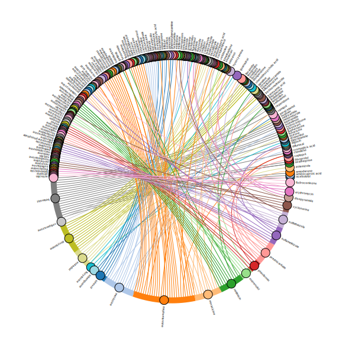
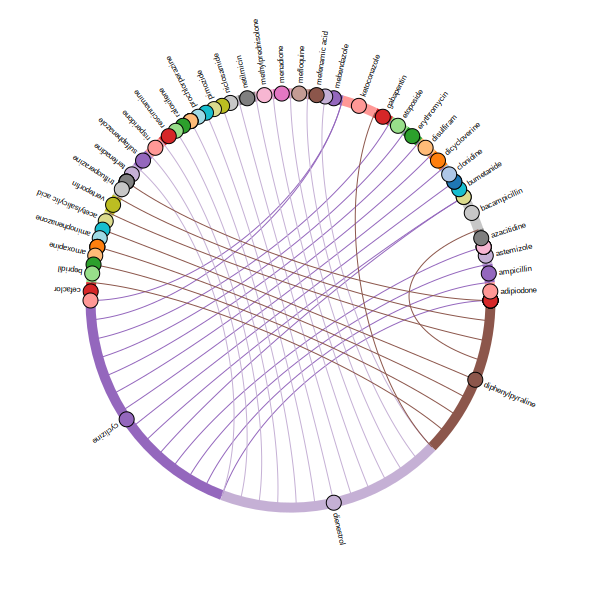
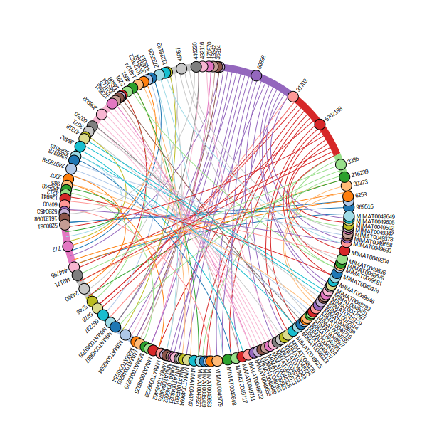

High-resolution figures in the paper
================

<figure>

<figcaption aria-hidden="true">Figure 6f (left)</figcaption>
</figure>

 

<figure>

<figcaption aria-hidden="true">Figure 6f (right)</figcaption>
</figure>

 

<figure>

<figcaption aria-hidden="true">Figure 6g</figcaption>
</figure>

 
