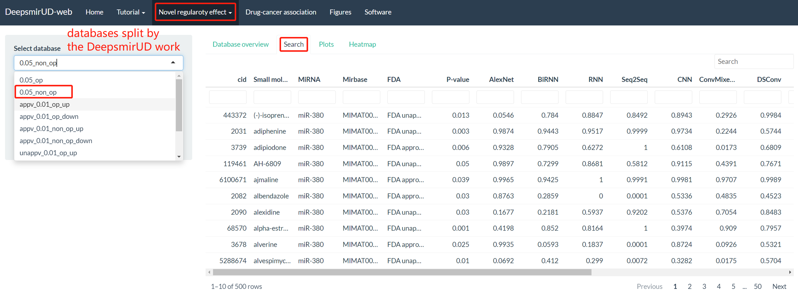
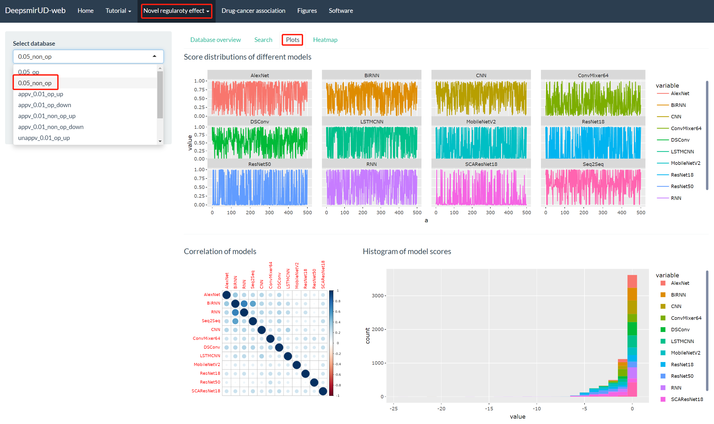
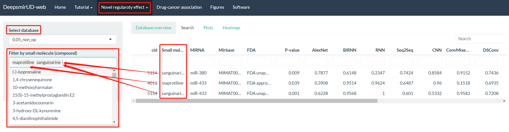
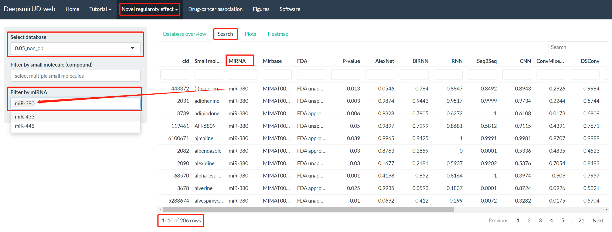

Through the "Novel regulatory effect" tab, users are directed to access the information of regulatory effects of small molecule-miRNA pairs curated from Psmir and Verse.

## 1. Curated small molecule-miRNA pairs from Psmir

### Step 1. Database selection

It provides a series of databases, which are made by using different p-values to filter data of the Psmir database. The databases are 0.05_op, 0.05_non_op, appv_0.01_op_up, appv_0.01_op_down, appv_0.01_non_op_up, appv_0.01_non_op_down, unappv_0.01_op_up, unappv_0.01_op_down, unappv_0.01_non_op_up, and unappv_0.01_non_op_down. appv is for FDA-approved. unappv is for FDA-unapproved. op is for overlapped, representing a miRNA or a small molecule in these small molecule-miRNA pairs are overlapped with miRNAs or small molecules in the DeepsmirUD training dataset. The loading page of the Psmir databases is shown in **Figure 1**. After the '0.05_non_op' database is selected, tables and plots are loaded as in **Figures 2-4**.

{width=95%}

 

{width=95%}

**Figure 2** shows the tables and plots after page loading. The tables provide small molecule-miRNA pair information, their predicted probabilities of regulatory effects and labels of down- or up-regulation. For plots, we provide the matrix of correlation between models, histogram, distribution, and heatmap (**Figure 3** and **Figure 4**). The plots interactively change with data in the tables.

{width=95%}

 

{width=95%}

 

### Step 2. Applying filters

#### (1). by small molecules

In a certain database, all small molecules are listed at dropdown 'Filter by small molecule (compound)' (**Figure 5**). If you do not know which small molecules should be of your interest, you can follow what is shown in **Figure 5** for filtering small molecule-miRNA pairs. If you have an idea of which small molecule should be used, you can filter small molecule-miRNA pairs according to **Figure 6**.

{width=95%}

 

{width=95%}

 

If we drag the table scroll bar rightmost, it shows that miR-433 is upregulated by vorinostat and miR-448 is downregulated by vorinostat (**Figure 7**).

{width=95%}

 

#### (2). by miRNAs

Similarly, we can select one of the miRNAs in the selected database to filter small molecule-miRNA pairs. There are 206 pairs left after a miR-380 filter is applied (**Figure 8**). Similar to filtering pairs by small molecules, if you have an idea of which miRNA should be used in your case, you can type in a miRNA, for example, miR-433 (**Figure 9**).

{width=95%}

 

{width=95%}

 

{width=95%}

 

If we drag the table scroll bar rightmost, we can see the predicted down-regulation and up-regulation types of small molecule-miR-448 pairs (**Figure 10**).

#### (3). by multiple conditions

Deepsmir-Web also allows users to screen the regulation pairs with multiple conditions, for example, miR-433, FDA-approved, and P-value (**Figure 11**).

{width=95%}

 

## 2. Curated small molecule-miRNA pairs from Verse

Similarly, for getting the regulatory effects of the Verse pairs users can apply as the same procedures as in Psmir (**Figure 12**).

{width=95%}

 

