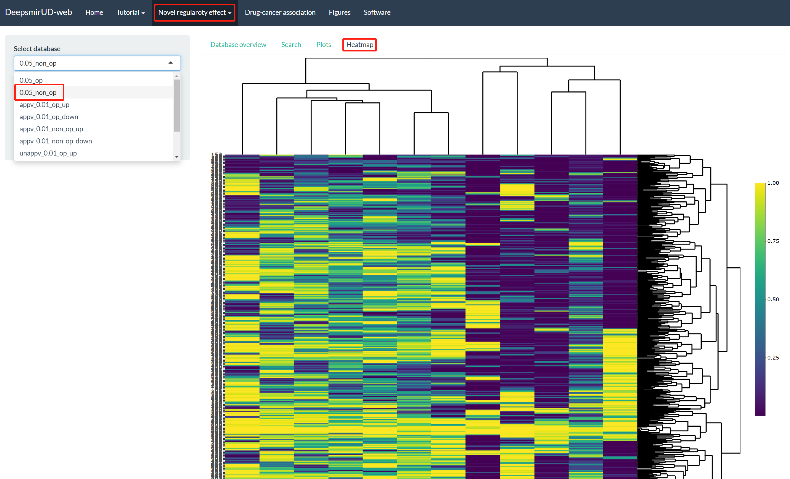
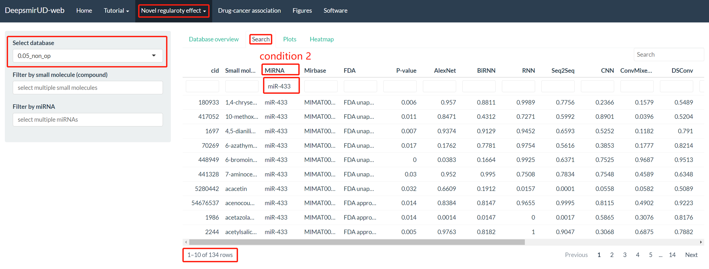
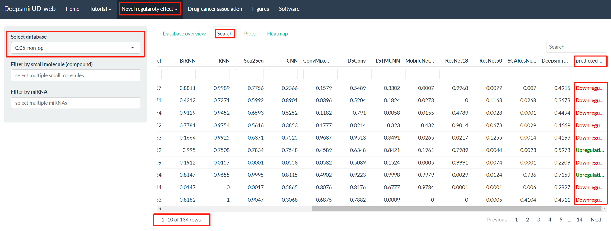

Through the "Novel regulatory effect" tab, users are directed to access the information of regulatory effects of small molecule-miRNA pairs curated from Psmir and Verse.

## 1. Curated small molecule-miRNA pairs from Psmir

### Step 1. Database selection

It provides a series of databases, which are made by using different p-values to filter data of the Psmir database. The databases are 0.05_op, 0.05_non_op, appv_0.01_op_up, appv_0.01_op_down, appv_0.01_non_op_up, appv_0.01_non_op_down, unappv_0.01_op_up, unappv_0.01_op_down, unappv_0.01_non_op_up, and unappv_0.01_non_op_down. appv is for FDA-approved. unappv is for FDA-unapproved. op is for overlapped, representing a miRNA or a small molecule in these small molecule-miRNA pairs are overlapped with miRNAs or small molecules in the DeepsmirUD training dataset. After the ‘0.05_non_op’ database is selected, tables and plots are loaded as in **Figure 1**.

{width=95%}

 

{width=95%}

 

{width=95%}

 

{width=95%}

 

### Step 2. Applying filters

#### (1). by small molecules

In a certain database, all small molecules are listed at dropdown ‘Filter by small molecule (compound)’ (**Figure 5**).

{width=95%}

 

If we drag the table scroll bar rightmost, it shows that miR-106b is upregulated by vorinostat and miR-1 is downregulated by vorinostat (**Figure 6**).

{width=95%}

 

#### (2). by miRNAs

Similarly, we can select one of the miRNAs in the selected database to filter small molecule-miRNA pairs. There are 259 pairs left after a miR-7 filter is applied (**Figure 7** and **Figure 8**).

{width=95%}

 

{width=95%}

 

#### (3). by multiple conditions

Deepsmir-Web also allows users to screen the regulation pairs with multiple conditions (**Figure 9**).

{width=95%}

 

## 2. Curated small molecule-miRNA pairs from Verse

Similarly, for getting the regulatory effects of the Verse pairs users can apply as the same precedures as in Psmir.

{width=95%}

 

