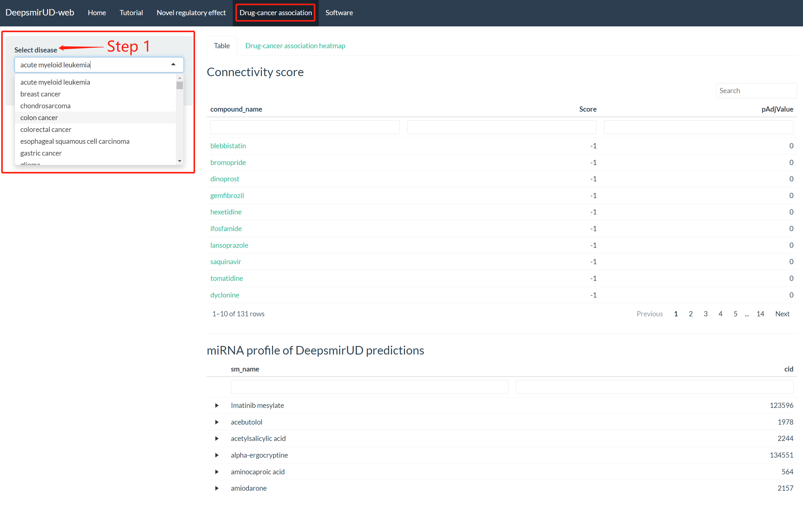
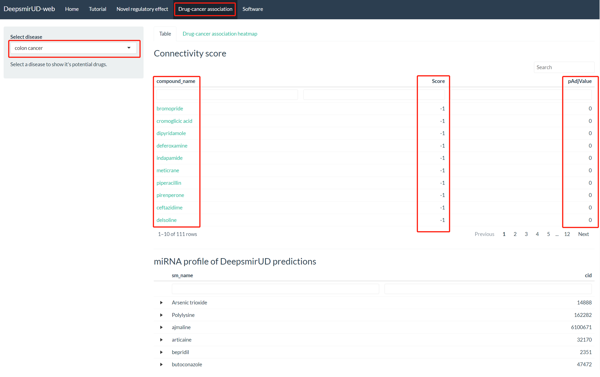
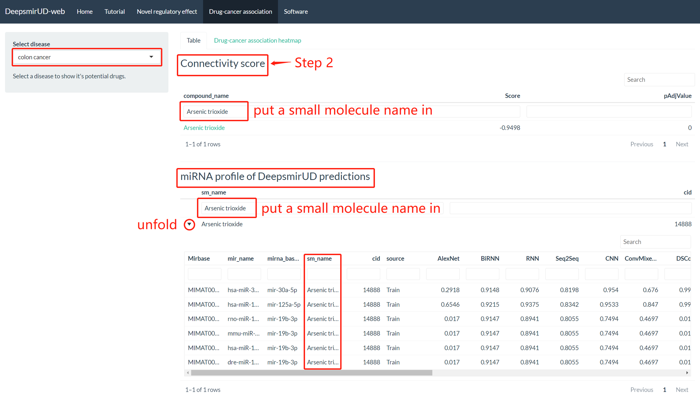
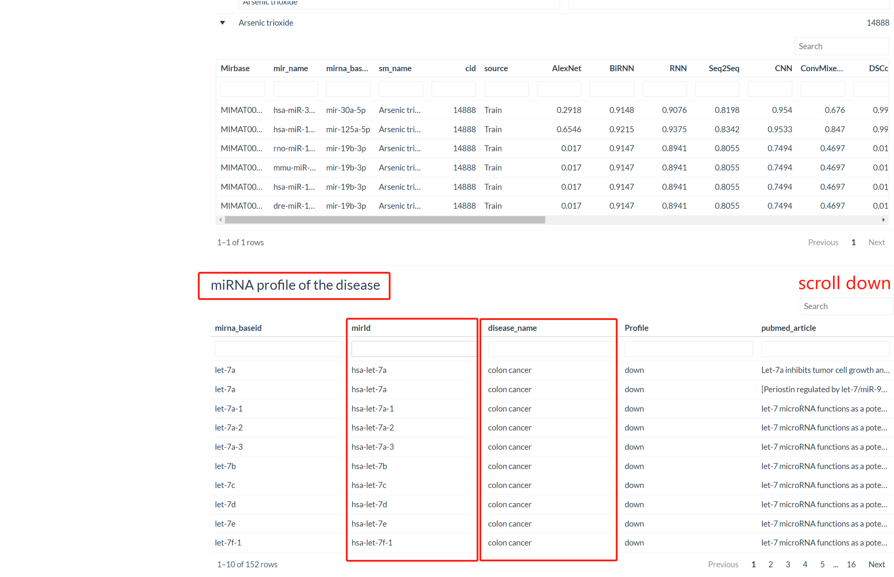
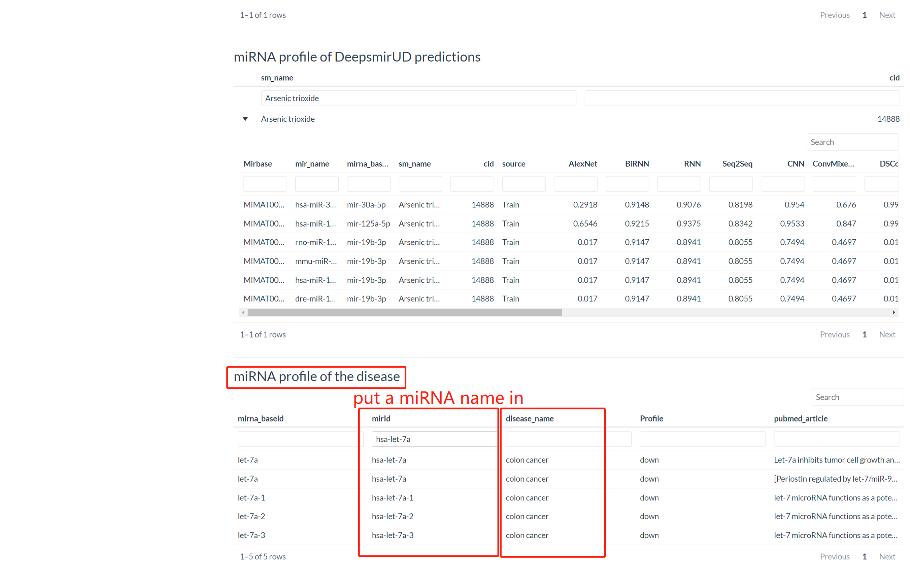

Drugs can be discovered using DeepsmirUD-Web. drug-cancer associations are built by calculating their connectivity scores, which requires a miRNA-disease database and our predicted up- and down-regulated small molecule-miRNA pairs. The final predicted associations involve a total of 107 cancers and 1343 small molecules. The resulting negative score suggests the pharmaceutical potential of a SM to treat a disease, while the positive score suggests a cognate perturbation profile between the SM and the disease. 

{width=95%}

 

**Figure 1** displays a workbench. Starting from selecting a certain cancer disease in the left dropdown, users will be allowed to access all drug potentials of small molecules for treating this disease in the first table on the right panel. There are three columns, compound_name, Score, pAdjValue, representing small molecule names, connectivity scores, and adjust p-values. The connectivity scores are set in ascending order by default, corresponding to highly druglike small molecules for this disease.

### Step 1. Selecting a disease

{width=95%}

 

For example, the colon cancer is selected, a total of 111 small molecules are listed. At the compound_name item, users can click on the small molecule names and see the Google search result about their introduction.

### Step 2. Selecting a small molecule or miRNA

Apart from providing the final drug choices in the first table, DeepsmirUD-Web gives two additional tables to access the regulation information of miRNAs related to the small molecule (**Figure 3**) and the disease (**Figure 4**). User can put a small molecule name in the ‘Connectivity score’ table as well as the ‘miRNA profile of DeepsmirUD predictions’ table. 

{width=95%}

 

For example, if arsenic trioxide is put in, its miRNA profile predicted by DeepsmirUD will be listed in the ‘miRNA profile of DeepsmirUD predictions’ table (**Figure 3**).

{width=95%}

 

For example, if the has-let-7a miRNA is put in the ‘miRNA profile of the disease’ table, the regulation information of miRNA related to the disease will be listed (**Figure 5**).

{width=95%}

 
