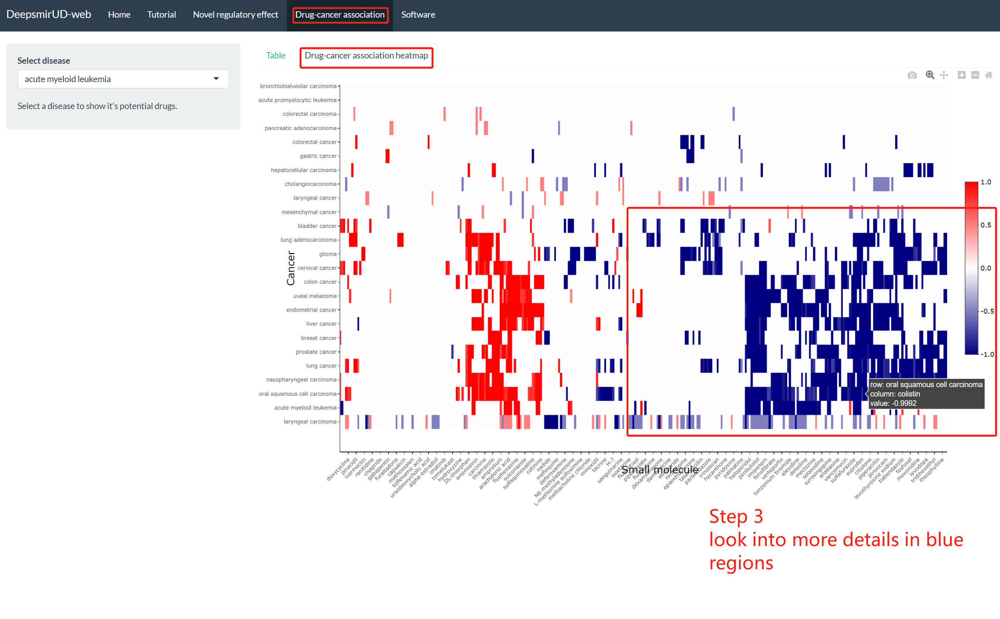

Heatmap of drug-cancer associations
================

The heatmap is accessible through choosing ‘Drug-cancer ssociation
heatmap’ under navigation mark ‘Drug-cancer association’. It records the
connectivity scores of 107x1343 combinations of small molecules and
cancer diseases. High drug potential is in blue and low drug potential
is in red.

<figure>

<figcaption aria-hidden="true">Figure 1. Heatmap of drug-cancer
associations</figcaption>
</figure>

 

Users can hover the cursor over any place in the heatmap and will see
the connectivity score of a drug to treat a certain disease. For
example, **Figure 1** shows a connectivity score of -1 of anabasine to
treat lung cancer.

<figure>

<figcaption aria-hidden="true">Figure 2. Select a certain
area.</figcaption>
</figure>

 

Users can select a certain area (**Figure 3**) in blue to look into
details since this area stores high-confidence drugs for disease
treatment. The area will be enlarged to ease the further check (**Figure
3**).

<figure>

<figcaption aria-hidden="true">Figure 3. Zoom-in of a certain
area.</figcaption>
</figure>

 
